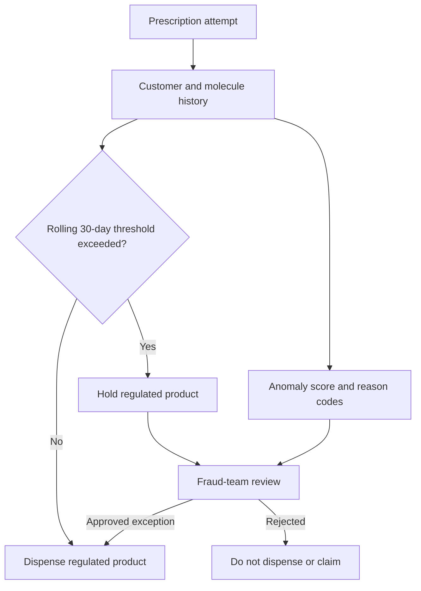

# Opioid Dispensing Risk & Fraud Prevention Analytics

A decision-focused analytics portfolio project demonstrating how a national pharmacy network could combine deterministic dispensing controls with explainable anomaly detection to prevent financial exposure and prioritize investigations.

> **Portfolio disclosure:** This project is inspired by a real business problem, but it does not contain former-employer data, code, confidential thresholds, customer information, or reported results. Every customer, transaction, product, insurer, location, authorization, financial value, and investigation case in this repository is synthetic.

## Executive summary

The simulated organization processes more than 10,000 prescriptions per day across 100 connected locations. For regulated opioid products, each molecule has a subject-matter-expert-defined maximum quantity within a rolling 30-day window.

Before a regulated item is dispensed, the system evaluates the customer's history across every location. A request that exceeds the applicable threshold is held for fraud-team review; unrelated products in the same order can continue normally. Approved exceptions are dispensed and paid by the insurer, while rejected requests are not dispensed and do not enter future purchasing history.

The portfolio extension adds an unsupervised anomaly score. It does **not** replace the threshold rule or label a customer as fraudulent. It prioritizes unusual activity for investigation and presents reason codes so reviewers can understand why a transaction received attention.

## Business questions

- Should this regulated product be dispensed, held, or rejected?
- Which high-risk alerts should investigators review first?
- Are customers moving between locations after a rejection?
- Are customers, collectors, prescribers, or authorizations connected across cases?
- Which molecules and brands are becoming more exposed to suspicious activity?
- What direct product cost and foregone profit were at risk?
- How much financial exposure did the control prevent?

## Solution design



The analytical design intentionally separates three layers:

1. **Deterministic control:** molecule-specific maximum units evaluated over a rolling 30-day window.
2. **Behavioural prioritization:** anomaly scoring based on transaction behaviour, never investigation outcomes.
3. **Relationship analysis:** customer, collector, authorization, prescriber, and location patterns used to support broader investigations.

## Dashboard pages

| Page | Decision supported |
|---|---|
| Risk overview | Monitor alert volume, exposure, and highest-priority investigations. |
| Transaction review | Review a regulated-product request and its cross-location history. |
| Customer behaviour | Examine purchasing timelines, molecule activity, and anomaly scores. |
| Group analysis | Investigate coordinated customers, collectors, and shared relationships. |
| Molecule & brand | Identify products with increasing alert volume or risk concentration. |
| Financial impact | Separate direct product cost, foregone profit, prevented exposure, and settlement delay. |

Screenshots will be added after the public Streamlit deployment so the repository and live application remain synchronized.

## Synthetic portfolio results

| Measure | Result |
|---|---:|
| Prescriptions represented | 7,385,701 |
| Detailed opioid transactions | 365,000 |
| Locations | 100 |
| Threshold alerts | 6,380 |
| Approved alerts | 2,553 (40.0%) |
| Rejected alerts | 3,827 (60.0%) |
| Historical unpaid exposure | $473,275.85 |
| Control-period exposure prevented | $284,210.35 |
| Coordinated synthetic cases recovered | 40 of 40 |

These are generated outcomes for demonstrating the analytical workflow; they are not claims about the original implementation's performance.

## Anomaly-detection interpretation

The anomaly model is a review-prioritization mechanism, not a fraud classifier. It is strongest when several behavioural signals reinforce one another, such as threshold exceedance, near-threshold repetition, authorization reuse, cross-location activity, or coordinated relationships.

| Validation measure | Synthetic result |
|---|---:|
| Transactions scored after warm-up | 319,917 |
| High-risk transactions | 6,413 |
| Medium-risk transactions | 16,098 |
| Precision in top 2% | 32.67% |
| Recall in high + medium bands | 27.54% |

The dashboard keeps the deterministic decision, anomaly score, and investigation evidence separate. An anomaly is never presented as proof of fraud.

## Technology

- **Python and pandas:** synthetic generation, transformations, and rule validation
- **scikit-learn:** explainable behavioural anomaly prioritization
- **Parquet and PyArrow:** compact, fast application data
- **Plotly:** interactive analytical visualizations
- **Streamlit:** public decision-support dashboard
- **unittest:** business-rule and page-rendering tests

## Repository structure

```text
.
├── app.py                    # Streamlit entry point
├── app_data/                 # Optimized synthetic deployment datasets
├── data/                     # Reproducible generated-data outputs (Git-ignored)
├── docs/
│   ├── data_dictionary.md
│   └── validation_report.md
├── scripts/
│   ├── generate_data.py
│   ├── build_analytics.py
│   └── export_app_data.py
├── src/                      # Rules, features, model, data loading, and pages
├── tests/                    # Business-rule and dashboard tests
└── requirements.txt
```

## Run locally

Python 3.10 or newer is recommended.

```bash
python -m venv .venv
```

Activate the environment:

```bash
# Windows PowerShell
.venv\Scripts\Activate.ps1

# macOS or Linux
source .venv/bin/activate
```

Install dependencies and start the dashboard:

```bash
pip install -r requirements.txt
streamlit run app.py
```

The committed files in `app_data/` allow the dashboard to start without regenerating the full dataset.

## Reproduce the synthetic data

```bash
python scripts/generate_data.py
python scripts/build_analytics.py
python scripts/export_app_data.py
```

The default run represents more than 7.3 million prescriptions through aggregate daily volume and generates approximately 365,000 detailed opioid dispensing attempts. For a faster development run:

```bash
python scripts/generate_data.py --scale 0.05
```

## Validate the project

```bash
python -m unittest discover -s tests -v
```

The checks cover the rolling-window boundary, rejected-unit history, financial calculations, approved project assumptions, and rendering of all six dashboard pages. See [`docs/validation_report.md`](docs/validation_report.md) for the complete analytical validation.

## Governance and limitations

- All data and outcomes are synthetic.
- Thresholds are illustrative SME-defined controls, not clinical recommendations.
- Prescriber, insurer, city, and customer demographics are excluded from model features.
- Investigation outcomes are not used as direct model inputs.
- A high anomaly score requires human investigation and is not evidence of misconduct.
- This application is an analytical portfolio demonstration, not a medical, dispensing, or law-enforcement system.
